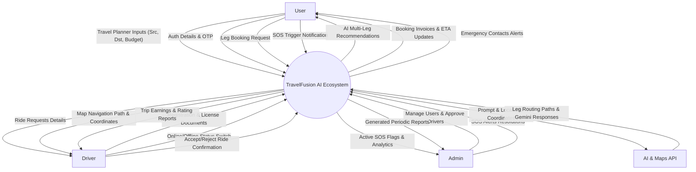
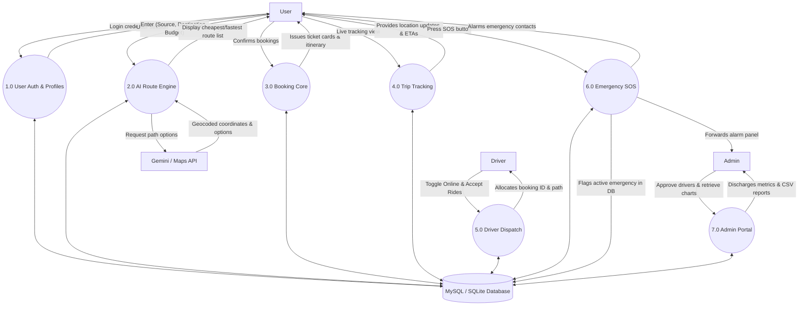

# TravelFusion AI – Data Flow Diagrams (DFD)

This document contains the Level 0 (Context) and Level 1 Data Flow Diagrams for the TravelFusion AI application.

---

## DFD Level 0: Context Diagram

The Context Diagram represents the system as a single process and maps all external inputs and outputs.

---

## DFD Level 1: Process Diagram

The Level 1 DFD decomposes the system into core sub-processes, identifying data stores and data paths.

