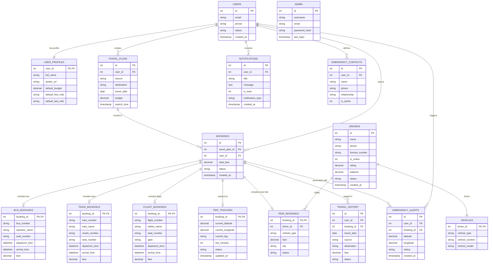

# TravelFusion AI – Entity-Relationship (ER) Diagram

This diagram displays the database structure for TravelFusion AI. It defines the tables, primary keys (`PK`), foreign keys (`FK`), and entity relationships.

