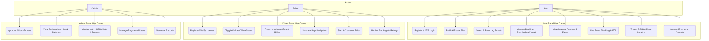

# TravelFusion AI – Use Case Diagram

This diagram displays the principal actors and use cases of the TravelFusion AI Ecosystem.

```mermaid
flowchart TD
    %% Actors
    subgraph Actors
        U[User]
        D[Driver]
        A[Admin]
    end

    %% User Use Cases
    subgraph User Panel Use Cases
        U1(Register / OTP Login)
        U2(Build AI Route Plan)
        U3(Select & Book Leg Tickets)
        U4(Manage Bookings - Reschedule/Cancel)
        U5(View Journey Timeline & Fares)
        U6(Live Route Tracking & ETA)
        U7(Trigger SOS & Share Location)
        U8(Manage Emergency Contacts)
    end

    %% Driver Use Cases
    subgraph Driver Panel Use Cases
        D1(Register / Verify License)
        D2(Toggle Online/Offline Status)
        D3(Receive & Accept/Reject Rides)
        D4(Simulate Map Navigation)
        D5(Start & Complete Trips)
        D6(Monitor Earnings & Ratings)
    end

    %% Admin Use Cases
    subgraph Admin Panel Use Cases
        A1(Approve / Block Drivers)
        A2(View Booking Analytics & Statistics)
        A3(Monitor Active SOS Alerts & Resolve)
        A4(Manage Registered Users)
        A5(Generate Reports)
    end

    %% Relationships
    U --> U1
    U --> U2
    U --> U3
    U --> U4
    U --> U5
    U --> U6
    U --> U7
    U --> U8

    D --> D1
    D --> D2
    D --> D3
    D --> D4
    D --> D5
    D --> D6

    A --> A1
    A --> A2
    A --> A3
    A --> A4
    A --> A5
```
